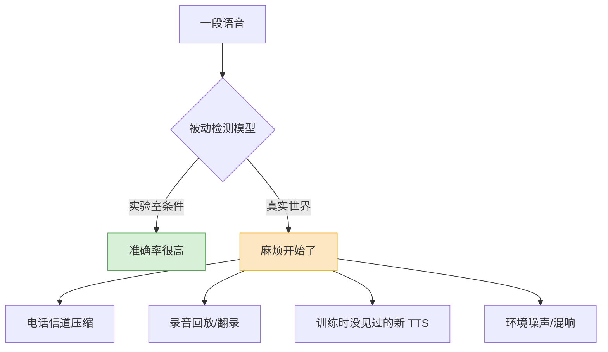
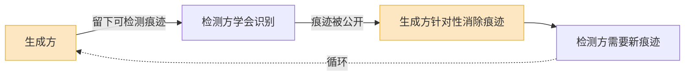

2025 年第一季度,美国境内利用深度伪造语音的电话诈骗(vishing)环比涨了 **1600% 多**。同一年 FBI 的互联网犯罪报告里,跟 AI 相关的诈骗投诉超过 2.2 万起,涉案金额 8.93 亿美元。

这些数字背后有一个让人不舒服的事实:**克隆一个人的声音,现在只需要三秒公开音频**。你公司高管参加过的每一场财报电话会、每一次大会演讲、每一段播客采访,都躺在公网上,对想用它的人来说就是现成的训练素材。

克隆技术本身已经不是新闻——这个博客之前写过《声音克隆:60秒复制你的声音,然后呢?》。这篇讲"然后"的另一面:声音一旦能被以假乱真地复制,我们靠什么分辨真假,以及这件事到底能做到多好。

## 滥用长什么样:三种,不是一种

把"AI 语音诈骗"当成一个笼统的词,会让你低估它。它至少是三类性质不同的攻击。

**第一类是社工诈骗。** 最经典的是"亲人求救":伪造你孩子的哭腔打电话说出事了急需用钱。但 2025 年真正造成大额损失的是企业版——伪造 CEO 或 CFO 的声音,指示财务转账。香港那起 2.56 亿港元的案子是个标志:财务员工参加了一场视频会议,会议里的 CFO 和同事**全是 AI 生成的**,人脸、口型、声音都对得上,他一开始怀疑是钓鱼,但一场"活的"视频会把他的怀疑全打消了,直到事后跟总部人工核对才发现。

**第二类是声纹绕过。** 不少银行和券商用"我的声音就是我的密码"做身份验证。克隆语音直接攻击这套系统。它比社工诈骗更隐蔽,因为受害的不是某个被吓住的人,而是一套**自动化的认证流程**——没有人在场可以"觉得不对劲"。2025 年 1 到 8 月,某金融机构的活体检测被 AI 伪造尝试绕过了 8000 多次。

**第三类是假音频内容。** 伪造公众人物的录音、伪造一段"泄露的会议录音"、给某段视频配上从没说过的话。它不针对个人钱包,针对的是舆论和信任。2024 年美国大选期间出现过伪造拜登声音的自动外呼电话,就是这一类。

三类攻击的防御手段完全不同。社工诈骗要靠流程和人的警觉,声纹绕过要靠活体检测,假内容要靠溯源和检测——别指望一招通吃。

## 检测合成语音:能做到,但有前提

检测分两条路:**被动检测**(拿到一段音频,判断它是不是 AI 合成的)和**主动标记**(生成时就打上记号)。先说被动。

被动检测模型在学术基准上的成绩相当好。这个领域有一套延续多年的评测体系——从早年的 ASVspoof 挑战赛,到 2026 年 ICME 的环境感知语音检测挑战赛(ESDD2)、ACM Multimedia 的全类型音频伪造检测挑战赛(AT-ADD)。检测模型也在进步:用 Whisper 这类大规模语音模型抽特征,比传统声学特征的等错误率(EER)低了约 21%,再针对反伪造任务微调 Whisper 编码器,还能再降近 15%。

听起来不错。但"在干净数据集上 EER 很低"和"在真实世界管用"之间,差了一整条鸿沟。

真实世界里有三个东西在持续打击检测准确率:

- **信道劣化。** 一通诈骗电话经过窄带编码、丢包、压缩,把那些"AI 痕迹"——比如不自然的高频细节、过于平滑的频谱——磨掉了大半。检测模型训练时见的是高保真音频,推理时拿到的是被电话线榨过的音频。
- **回放攻击。** 攻击者把合成音频用音箱播出来、再用麦克风录下来。这一录一放,等于给假音频套了一层"真实物理世界"的外衣,很多检测器会被骗过。专门为这种场景做的数据集(比如 EchoFake)就是冲着这个问题来的。
- **泛化。** 这是最根本的。检测模型本质上是在学"已知的几种 TTS 系统留下的指纹"。一个训练时没见过的新模型出来,检测器对它就是睁眼瞎。而新的 TTS 模型几乎每个月都在出。

所以我的判断是:**被动检测有用,但不能当成单点防线。** 它适合做大规模内容平台的初筛、做事后取证,不适合做"接到电话实时告诉你这是假的"那种承诺——任何号称能实时、高准确、对所有声音通杀的检测产品,你都该多问几句它在什么数据上测的。

## 声纹活体:防的是"录音",未必防得住"克隆"

声纹认证系统自己也有反伪造机制,通常叫"活体检测"(liveness detection)。但要分清它原本是防什么的。

活体检测最早是为了防**回放攻击**——防止有人拿一段你说话的录音来冒充你。它会去找录音特有的痕迹:音箱的频响特性、二次录制引入的失真、缺少真人说话该有的呼吸和微小变化。对着录音,这套机制管用。

问题是,**高质量的神经网络合成语音不是"录音"**。它没有音箱频响的指纹,它的呼吸、停顿、韵律是模型直接生成的,看起来比一段翻录干净得多。换句话说,为防回放设计的活体检测,面对端到端克隆语音时,部分假设已经不成立了。

更麻烦的是"语音变形"(voice morphing)攻击——把攻击者自己的真实语音和目标人的声纹特征混合,生成的音频既带着真人说话的所有物理特征(因为底子是真人录的),又带着目标人的声纹。这种攻击专门钻活体检测和声纹比对之间的缝。

现在还有"深度伪造即服务"(Deepfake-as-a-Service)——黑产把克隆和绕过工具打包成服务卖,一套合成身份、克隆声音的素材,在地下市场只要五美元。攻击的门槛已经低到不需要任何技术。

我的看法直接一点:**2026 年,"声音即密码"这个产品设计应该被淘汰了。** 声纹可以作为**一个**信号参与风险评分,但不能作为单一凭证去解锁转账、改密码这类高危操作。把一个已经能被三秒素材复制的东西当成身份证明,是设计缺陷,不是技术细节。

## 音频水印:把检测的难题倒过来

被动检测难,难在它要从音频里"反推"真假。**主动水印**换了个思路:在 AI 生成语音的那一刻,就在音频里嵌一个人耳听不见、但机器能检出的标记。这样要回答的问题从"这段音频是不是假的"变成了"这段音频里有没有我的水印"——后者好回答得多。

Meta 的 AudioSeal 是目前最有代表性的方案。它的设计有两个关键点值得说:

**一是定位能力。** 它不只能判断"整段音频有没有水印",还能精确到样本级——在 16kHz 采样率下,能指出每一个 1/16000 秒的片段是不是带水印的。这意味着如果有人把一句真人录音里**只抠掉几个字、换成合成的**,水印检测能定位到那几个字。

**二是检测速度。** 它用单次前向的检测器,比靠水印密钥逐一解码的老方法快两个数量级。这点对落地很重要——内容平台要扫的是每天上传的海量音频,检测器慢一点,整个方案就不可行。

水印的真正价值不在"抓坏人",在**给善意内容一个可以自证清白的办法**。一家正规 TTS 服务给自己所有输出打上水印,等于主动声明"这是我生成的";新闻机构给自己的真实采访录音打上来源标记,等于主动声明"这是真的"。社会需要的不是"找出所有假音频",而是逐步建立"没标记的内容默认不可信"的预期。

但水印不是银弹,它有两个硬伤:

| 问题 | 具体表现 |
|---|---|
| 只能管"听话的人" | 开源模型、自己训练的模型、刻意去水印的攻击者,根本不会嵌水印。水印覆盖不到真正想作恶的人。 |
| 鲁棒性有上限 | 重度压缩、变调、加噪、片段裁剪,都可能削弱甚至擦除水印。AudioSeal 这类方案在鲁棒性上做了很多工作,但"绝对擦不掉"做不到。 |

所以水印解决的是"占大多数的正规生成内容如何被标记"的问题,不解决"恶意攻击者"的问题。把它和被动检测、和内容来源标准(比如 C2PA 那套溯源元数据)叠在一起,才构成一张有意义的网。

## 为什么这注定是猫鼠游戏

讲到这里该说一句不太好听的:**合成语音检测,在原理上就是一场打不赢的军备竞赛。**

原因不在哪个团队不够努力,在结构。生成模型和检测模型之间存在一个根本的不对称——

每当检测方发现一类"AI 痕迹"并公开(发论文、开源模型、办挑战赛),这个发现立刻变成生成方的优化目标——下一代 TTS 训练时,只要把"骗过这个检测器"加进损失函数,痕迹就被磨掉了。检测方天然滞后,因为它只能对**已经存在**的生成模型做出反应。

更不利的是终点不一样。生成方的目标是"无限逼近真人",而真人语音是存在的、有上限的;一旦合成语音在物理特征上和真人无法区分,检测方就**没有信号可用了**——不是检测器不够好,是信息论意义上无东西可检。

那是不是就躺平?不是。结论应该是:**别把宝押在"检测出假的"上,要把重心移到"验证出真的"。**

- 检测假音频是开放问题,可能永远做不到 100%。
- 验证真音频是封闭问题:水印、数字签名、内容来源链(C2PA),这些是可以做到接近确定的——因为它不依赖猜测,依赖密码学。

防御的长期方向,是让"可信"成为需要主动证明的东西,而不是默认状态。

## 平台和个人,各自能做什么

技术讲完,落到行动。

**对平台和企业:**

- **高危操作做带外验证(out-of-band)。** 转账、改预留信息、授权放款,绝不能只凭一通电话或一段语音确认。换一个独立信道——回拨已登记的号码、在内部系统二次确认、设一个对方知道你知道的口令。香港那 2.56 亿的案子,只要一通打回总部的电话就能拦下。
- **声纹只做风控信号,不做唯一凭证。** 把它和设备指纹、行为特征、信道分析一起喂进风险评分,任何一个高危动作都要多因子。
- **自家生成的语音一律打水印、留来源标记。** 这不是为了抓别人,是为了让你的正规内容可被验证,也是给行业立规矩。
- **检测模型当初筛和取证用,别对外承诺实时通杀。** 同时持续用新出的 TTS 系统更新训练集——你的检测器和攻击者用的生成器,得在同一个时代。

**对个人:**

- **认知层面接受一件事:听到的声音不再等于身份证明。** 这是 2026 年最需要更新的常识。电话里"你妈的声音"、"你老板的声音",都不构成"确实是本人"的证据。
- **和家人约一个口令。** 一个只有你们知道、不会出现在任何社交媒体上的词。接到"家人急用钱"的电话,先问口令。土办法,但有效。
- **挂掉,回拨。** 任何涉及钱或敏感信息的来电,无论声音多像,挂掉,用你通讯录里**原本存的**号码打回去。克隆语音能伪造声音,伪造不了你主动拨出的这通电话。
- **少喂素材。** 三秒就够克隆。公开演讲、播客、短视频里的长段清晰人声,本质上是在公网上发布自己的声纹。这不是让你别说话,是让你知道代价。

最后留一句判断:这场对抗里,纯技术解(更强的检测器)只能拖时间,拖不到终局。真正能把损失压下去的,是**流程**——带外验证、口令、回拨这些听起来很"低科技"的东西。当声音不再可信,可信的得是别的:你拨出去的号码、你和家人之间的暗号、系统里另一个独立的确认信道。技术制造了这个问题,但解决它,要靠把"信任"重新放回那些不能被三秒音频复制的地方。

---

*参考来源:[FBI AI 语音钓鱼预警](https://www.blackfog.com/fbi-warning-ai-voice-phishing-how-to-stop-threat/)、[深度伪造 CEO 诈骗案例分析](https://cybelangel.com/blog/deepfake-ceo-fraud-how-voice-cloning-targets-us-executives/)、[AudioSeal:语音克隆的主动检测水印](https://arxiv.org/abs/2401.17264)、[ESDD2 环境感知语音伪造检测挑战赛](https://arxiv.org/html/2601.07303v3)、[语音生物识别攻击面扩大](https://www.biometricupdate.com/202604/voice-ai-expands-attack-surface-for-speaker-biometrics-as-apis-proliferate)、[深度伪造即服务报告](https://www.biometricupdate.com/202601/deepfake-as-a-service-revolutionizing-biometrics-spoofing-and-identity-fraud-report)。*
