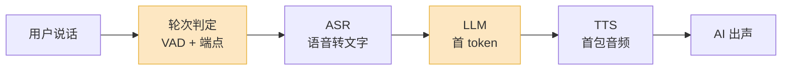
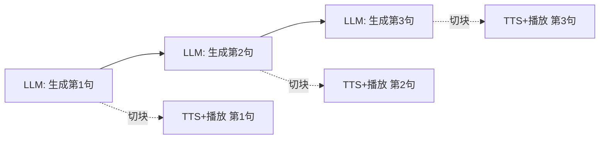

你跟一个语音 AI 说完话,它停顿了一下,才开口回答。

那一下"停顿",就是它不像人的地方。

人类对话的轮次间隔(turn-taking gap)中位数只有约 **200ms**,熟悉的人之间还经常"抢话"——下一句在上一句结束前就接上了。一旦 AI 的回应超过 **500ms**,你会明显感觉到"它在想";超过 **800ms**,对话就开始别扭,你会忍不住重复自己,或者以为它没听见。

所以做语音 Agent,延迟不是"优化项",是**及格线**。这篇把从【用户说完最后一个字】到【AI 喇叭里出第一个音】之间发生的事,拆到毫秒。

## 这条流水线长什么样

橙色的两块——**轮次判定**和 **LLM 首 token**——是预算里最大的两笔开销,也是最值得花力气的地方。

## 一份现实的延迟预算

| 环节 | 它在做什么 | 典型耗时 |
|---|---|---|
| 轮次判定(VAD + 端点) | 判断"用户真的说完了" | 50–250 ms |
| ASR(语音转文字) | 把语音转成文字 | ~0–150 ms\* |
| LLM 首 token(TTFT) | 想出第一个字 | 250–500 ms |
| TTS 首包 | 合成出第一段音频 | 75–200 ms |
| 网络往返 | 客户端 ↔ 服务端 | 30–80 ms |
| **合计(可感知)** | | **约 500–900 ms** |

\* ASR 与用户说话**并行**进行,大部分转写在用户说完之前就做完了,所以它对预算的**增量**很小——前提是你用的是流式 ASR。

## 逐段拆开

### 轮次判定:延迟里的隐形大头

最容易被忽略、又最肥的一块。

很多系统用一个固定的"静音超时"来判断用户说完了——比如静音持续 700ms 就认为该 AI 说话了。问题是:**这 700ms 是凭空加在每一句话上的延迟**,而且用户说话中间正常的停顿(想词、换气)还会触发误判。

2026 年更好的做法是**语义端点检测**(semantic turn detection):用一个很小的模型实时判断"这句话在语义上说完了没"。"我想订一张去——"显然没说完,哪怕这里静音了 800ms;"我想订一张去北京的机票"说完了,300ms 就可以接。把固定静音超时换成语义判定,这一段常常能从 250ms 砍到 100ms 以内。

### ASR:让它和说话并行,就几乎不要钱

ASR 唯一的纪律是:**必须流式**。流式 ASR 一边听一边转写,用户说完时文字基本也就好了,只剩最后一个分块的尾巴。如果你用的是非流式("等录音结束再整段识别"),那等于把整段语音时长又加回了预算——一句 3 秒的话就白白多 3 秒。这是新手最常见的坑。

### LLM 首 token:最大的一块,也最难压

LLM 拿走了预算里最大的份额,因为它最难在不牺牲回答质量的前提下压缩。

关键认知:你要的是 **TTFT(首 token 延迟)低**,不是"整段生成快"。用户只需要尽快听到**第一个字**,后面的边生成边说。能压 TTFT 的手段:

- **缩短 system prompt**——每一个 token 都要参与首次前向计算
- **prompt caching**——把固定的前缀缓存住,省掉重复的 prefill
- **小模型兜首句**——用一个快模型先回"嗯""好的,我看一下",大模型在背后接管
- **投机解码 / 更近的推理节点**——把网络和排队的尾巴削掉

### TTS 首包:同样只看"第一段"

和 LLM 一个道理——要流式 TTS,**首包(time-to-first-audio)**出来就播,别等整句合成完。再把 LLM 的输出按标点/句子切块,边出边喂给 TTS。现代流式 TTS 的首包能做到 75–200ms。

## 流式的魔法:感知延迟 ≠ 真实延迟

这是整套设计的核心。

一次完整回答的**真实**总耗时可能有 1.5 秒甚至更长。但用户感受到的延迟,只是**到第一个音**的那段时间——因为 LLM 还在生成后半句时,前半句已经在用户耳朵里播了。

所以工程上的铁律:**这条链路上任何一环都不能"攒齐再传"**。VAD、ASR、LLM、TTS,全部流式串起来,一环阻塞,整条链路的"感知延迟"就塌回成"真实延迟"。

## 打断(barge-in):不只是"停 TTS"

人会打断。语音 Agent 必须能被打断,而且打断要干净。

用户插话时,要做的**不止**是停掉正在播的音频,而是四件事一起:

1. 停止 TTS 音频播放
2. 取消**还在合成**的 TTS 任务
3. 取消**还在生成**的 LLM 请求
4. 重置整条流式管道的状态

漏掉任何一步,AI 要么跟你抢着说,要么在你打断之后还要"把上一个念头说完"。

另一个反方向的坑是**误打断**:背景噪音、旁边人说话、你自己的"嗯哼",都可能被当成插话。解法是带说话人意识的 VAD(personalized VAD),只对"主说话人"的语音触发打断。

## 级联 vs 端到端:2026 年怎么选

- **级联**(ASR → LLM → TTS):三个模块各自独立。可控、可调试、每一环都能单独监控和替换。2026 年它仍然是生产环境的默认选择,尤其是电话客服这种强管控、强合规的场景。
- **端到端语音模型**(speech-to-speech):语音直接进、语音直接出,中间不落文字。延迟更低,情感和韵律保留得更好(信息没有在"转成文字再转回来"的过程中丢失)。代价是难调试、难审计、难合规。

我的判断:别把它当成二选一。强管控场景用级联;Web 端的陪伴、互动类产品可以上端到端;成规模的团队最后大概率是**两套都跑,按场景路由**。

## 最后:工程优先级别搞反

如果你在做语音 Agent,优化的顺序应该是:

1. **先把流式管道打通**——确保没有任何一环在"攒齐再传"。这一步的收益最大,而且不花钱。
2. **再砍轮次判定**——把固定静音超时换成语义端点检测。
3. **最后才去抠 LLM**——换小模型、上 prompt caching、投机解码。

很多团队一上来就盯着"换个更快的大模型",但如果你的管道根本不是流式的,换什么模型都救不回那种"慢半拍"的感觉。先把链路理顺,再谈毫秒。
