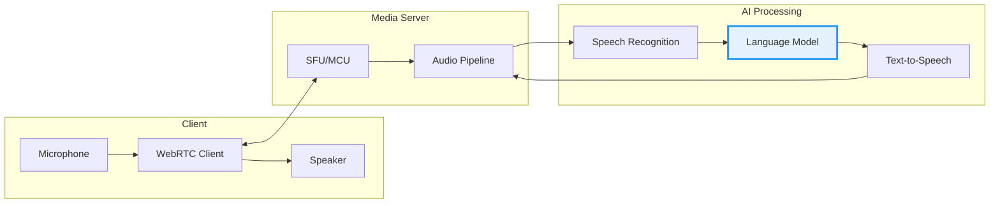

## Introduction

Real-time voice AI represents the cutting edge of human-computer interaction. By combining WebRTC's low-latency communication capabilities with modern AI models, we can create conversational systems that respond naturally and instantly.

This guide walks through the complete architecture for building production-ready voice AI applications.

## System Architecture



### Core Components

1. **WebRTC Client**: Handles media capture, encoding, and real-time transport
2. **Media Server**: Routes audio streams and manages session state
3. **AI Pipeline**: Processes speech through ASR → LLM → TTS chain

## WebRTC Setup

### Client-Side Implementation

```javascript
class VoiceAIClient {
  constructor(serverUrl) {
    this.serverUrl = serverUrl;
    this.peerConnection = null;
    this.audioContext = null;
    this.mediaStream = null;
  }

  async initialize() {
    // Get microphone access
    this.mediaStream = await navigator.mediaDevices.getUserMedia({
      audio: {
        echoCancellation: true,
        noiseSuppression: true,
        autoGainControl: true,
        sampleRate: 16000
      }
    });

    // Create peer connection
    this.peerConnection = new RTCPeerConnection({
      iceServers: [
        { urls: 'stun:stun.l.google.com:19302' }
      ]
    });

    // Add audio track
    const audioTrack = this.mediaStream.getAudioTracks()[0];
    this.peerConnection.addTrack(audioTrack, this.mediaStream);

    // Handle incoming audio
    this.peerConnection.ontrack = (event) => {
      this.handleIncomingAudio(event.streams[0]);
    };

    // Create and send offer
    const offer = await this.peerConnection.createOffer();
    await this.peerConnection.setLocalDescription(offer);
    
    const answer = await this.sendOfferToServer(offer);
    await this.peerConnection.setRemoteDescription(answer);
  }

  handleIncomingAudio(stream) {
    const audio = new Audio();
    audio.srcObject = stream;
    audio.play();
  }

  async sendOfferToServer(offer) {
    const response = await fetch(`${this.serverUrl}/offer`, {
      method: 'POST',
      headers: { 'Content-Type': 'application/json' },
      body: JSON.stringify({ sdp: offer.sdp, type: offer.type })
    });
    return response.json();
  }
}
```

### Server-Side with aiortc (Python)

```python
import asyncio
from aiortc import RTCPeerConnection, RTCSessionDescription
from aiortc.contrib.media import MediaRelay
from aiohttp import web

relay = MediaRelay()
pcs = set()

async def offer_handler(request):
    params = await request.json()
    offer = RTCSessionDescription(sdp=params["sdp"], type=params["type"])
    
    pc = RTCPeerConnection()
    pcs.add(pc)
    
    @pc.on("track")
    def on_track(track):
        if track.kind == "audio":
            # Process audio through AI pipeline
            processor = AudioProcessor(track)
            pc.addTrack(processor.output_track)
    
    await pc.setRemoteDescription(offer)
    answer = await pc.createAnswer()
    await pc.setLocalDescription(answer)
    
    return web.json_response({
        "sdp": pc.localDescription.sdp,
        "type": pc.localDescription.type
    })

app = web.Application()
app.router.add_post("/offer", offer_handler)
```

## Audio Processing Pipeline

### Voice Activity Detection

Efficient VAD is critical for reducing unnecessary processing:

```python
import webrtcvad
import numpy as np

class VoiceActivityDetector:
    def __init__(self, sample_rate=16000, aggressiveness=3):
        self.vad = webrtcvad.Vad(aggressiveness)
        self.sample_rate = sample_rate
        self.frame_duration_ms = 30
        self.frame_size = int(sample_rate * self.frame_duration_ms / 1000)
        
    def is_speech(self, audio_frame: bytes) -> bool:
        """Detect if frame contains speech."""
        return self.vad.is_speech(audio_frame, self.sample_rate)
    
    def process_stream(self, audio_generator):
        """Process audio stream and yield speech segments."""
        speech_buffer = []
        silence_count = 0
        max_silence_frames = 10  # ~300ms
        
        for frame in audio_generator:
            if self.is_speech(frame):
                speech_buffer.append(frame)
                silence_count = 0
            else:
                silence_count += 1
                if speech_buffer and silence_count > max_silence_frames:
                    yield b''.join(speech_buffer)
                    speech_buffer = []
                    silence_count = 0
```

### Streaming ASR Integration

```python
from openai import OpenAI
import io
import wave

class StreamingASR:
    def __init__(self):
        self.client = OpenAI()
        
    async def transcribe(self, audio_data: bytes, sample_rate=16000) -> str:
        """Transcribe audio using Whisper API."""
        # Create WAV file in memory
        buffer = io.BytesIO()
        with wave.open(buffer, 'wb') as wav:
            wav.setnchannels(1)
            wav.setsampwidth(2)
            wav.setframerate(sample_rate)
            wav.writeframes(audio_data)
        
        buffer.seek(0)
        buffer.name = "audio.wav"
        
        response = self.client.audio.transcriptions.create(
            model="whisper-1",
            file=buffer
        )
        
        return response.text
```

## Latency Optimization

### Key Strategies

| Technique | Latency Reduction | Implementation Complexity |
|-----------|------------------|---------------------------|
| Streaming TTS | 50-70% | Medium |
| Sentence-level processing | 30-40% | Low |
| Audio chunking | 20-30% | Low |
| Edge deployment | 40-60% | High |

### Streaming TTS Example

```python
async def stream_tts_response(text_stream, tts_client):
    """Stream TTS as text is generated."""
    sentence_buffer = ""
    
    async for chunk in text_stream:
        sentence_buffer += chunk
        
        # Check for sentence boundaries
        if any(sentence_buffer.rstrip().endswith(p) for p in '.!?'):
            audio = await tts_client.synthesize(sentence_buffer)
            yield audio
            sentence_buffer = ""
    
    # Handle remaining text
    if sentence_buffer.strip():
        audio = await tts_client.synthesize(sentence_buffer)
        yield audio
```

## Production Considerations

### Error Handling

```python
class RobustVoiceAI:
    def __init__(self):
        self.retry_config = {
            'max_attempts': 3,
            'backoff_factor': 1.5
        }
    
    async def process_with_fallback(self, audio):
        """Process audio with automatic fallback."""
        try:
            return await self.primary_asr.transcribe(audio)
        except Exception as e:
            logger.warning(f"Primary ASR failed: {e}")
            return await self.fallback_asr.transcribe(audio)
```

### Monitoring Metrics

Track these key metrics for production systems:

- **End-to-end latency**: Target < 500ms
- **ASR accuracy**: Word Error Rate (WER)
- **Voice activity detection precision**
- **Connection stability**

## Conclusion

Building real-time voice AI requires careful attention to latency at every stage. WebRTC provides the foundation for low-latency audio transport, while modern AI services handle the intelligence layer.

Key takeaways:
1. Use WebRTC for reliable, low-latency audio transport
2. Implement VAD to minimize unnecessary processing
3. Stream TTS output for perceived responsiveness
4. Build in fallbacks for production reliability

## References

- [WebRTC Official Documentation](https://webrtc.org/)
- [aiortc Python Library](https://github.com/aiortc/aiortc)
- [OpenAI Whisper API](https://platform.openai.com/docs/guides/speech-to-text)
