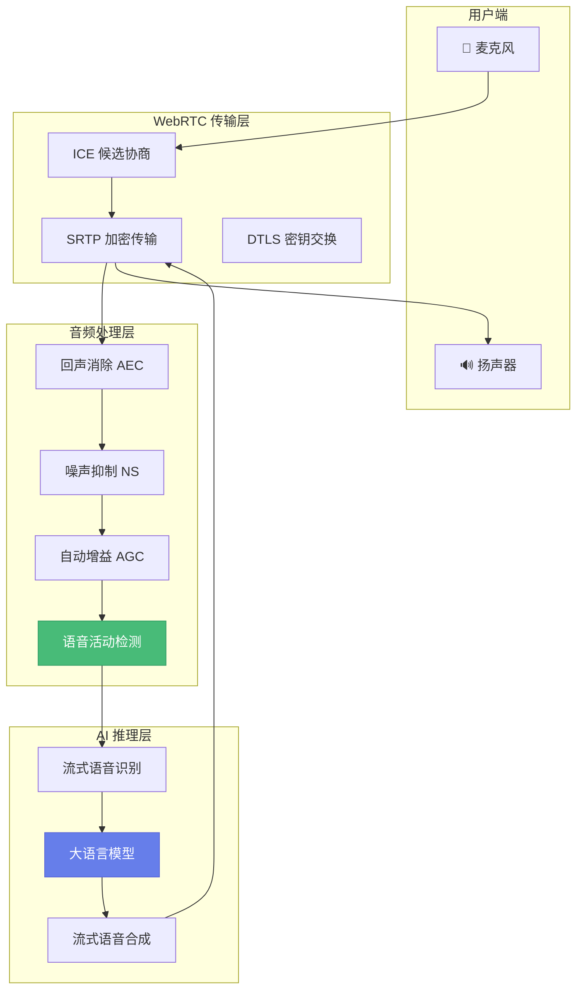
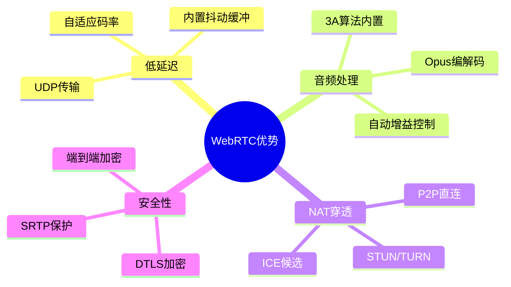
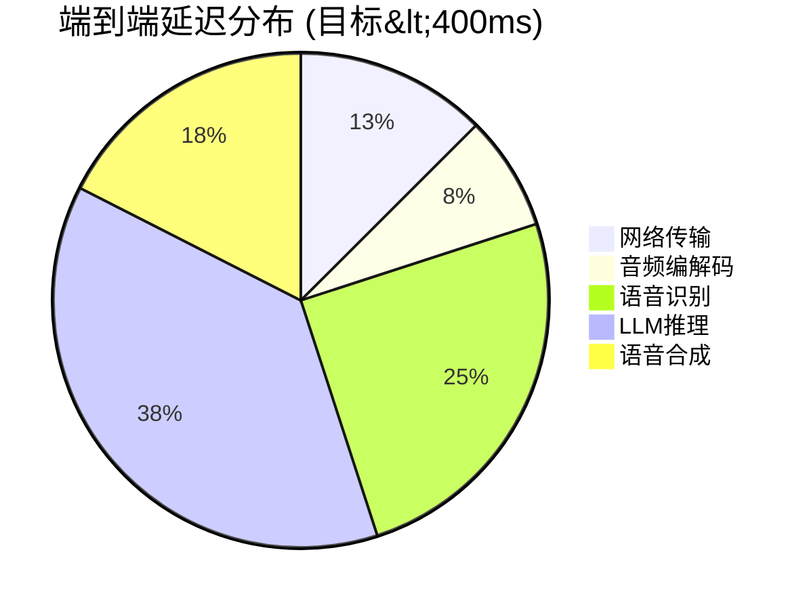
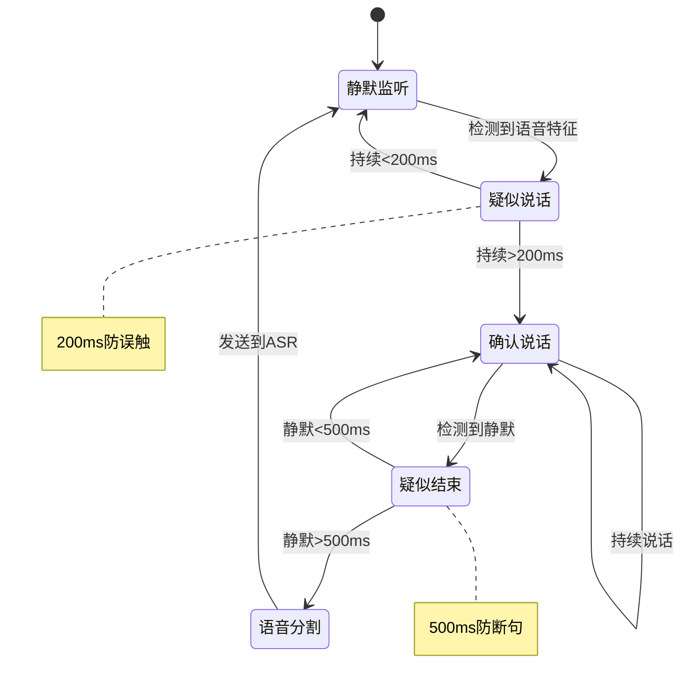
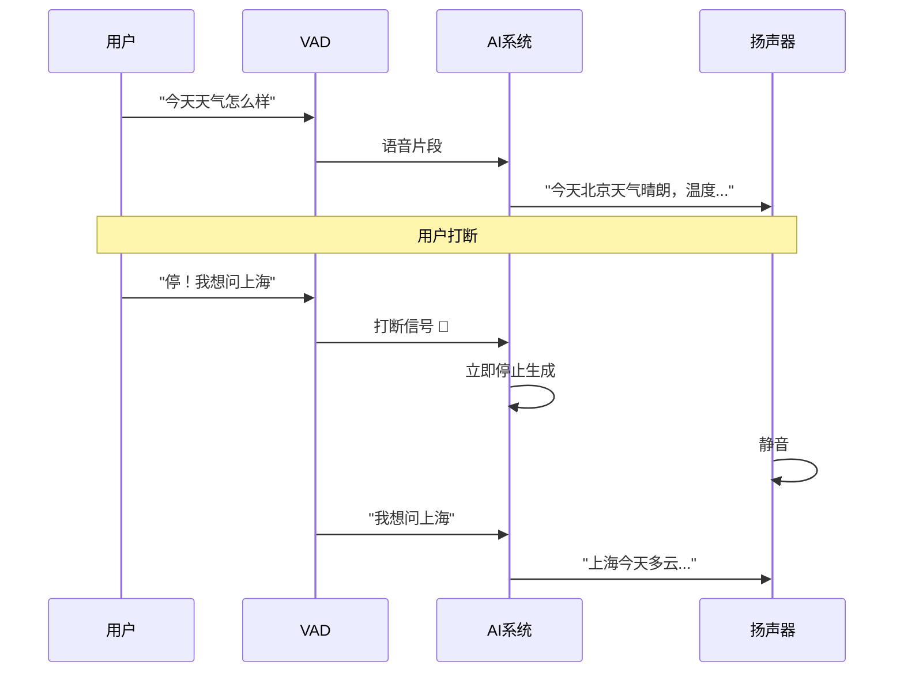
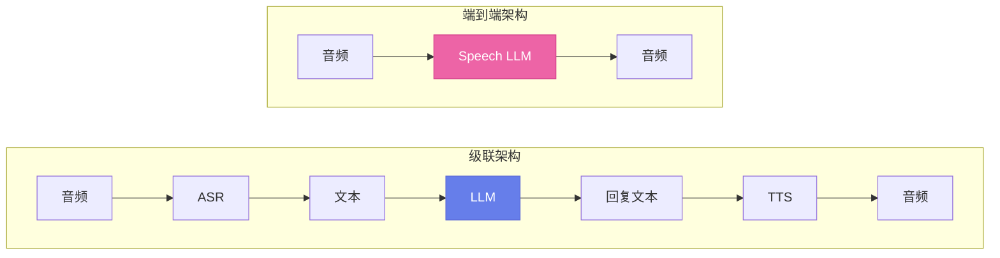
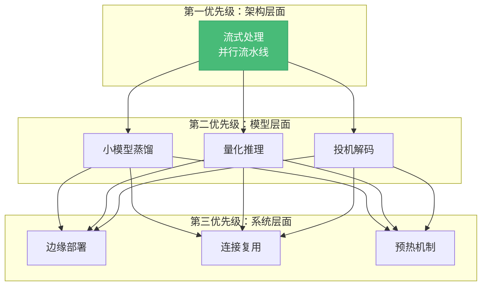
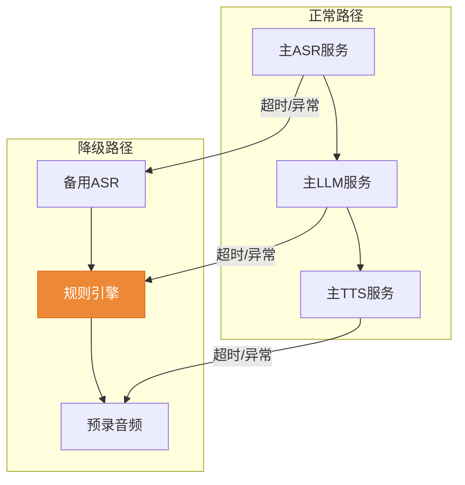

## 为什么实时语音AI是下一个前沿

2024年，OpenAI发布了GPT-4o的实时语音模式，用户可以像打电话一样与AI自然对话。这标志着人机交互进入了新纪元——从"打字等待"到"即时对话"。

但构建这样的系统远比看起来复杂。本文将深入探讨背后的技术挑战与解决方案。

---

## 核心挑战：为什么延迟如此重要

人类对话的自然节奏要求响应延迟在 **200-400ms** 以内。超过这个阈值，对话就会变得不自然，用户体验急剧下降。

```mermaid
gantt
    title 传统语音AI vs 实时语音AI 延迟对比
    dateFormat X
    axisFormat %s
    
    section 传统方案
    录音完成等待    :a1, 0, 500
    语音识别(ASR)   :a2, after a1, 800
    LLM推理        :a3, after a2, 1500
    语音合成(TTS)   :a4, after a3, 600
    总延迟 3.4秒    :milestone, after a4, 0
    
    section 实时方案  
    流式ASR        :b1, 0, 200
    流式LLM        :b2, 100, 400
    流式TTS        :b3, 300, 300
    首响应 0.3秒    :milestone, 300, 0
```

> **关键洞察**: 实时系统的核心不是让每个组件更快，而是通过**流水线并行化**让各阶段同时工作。

---

## 系统架构全景

### 三层架构的设计考量

| 层级 | 关键职责 | 技术选型考量 |
|------|----------|--------------|
| **传输层** | 低延迟、可靠性、穿透NAT | WebRTC优于WebSocket（内置抖动缓冲、丢包重传） |
| **音频处理层** | 提升信号质量、减少误识别 | 本地处理 vs 云端处理的权衡 |
| **AI推理层** | 理解意图、生成响应 | 端到端模型 vs 级联模型 |

---

## 深入WebRTC：不只是传输协议

### WebRTC的独特优势

很多人认为WebSocket也能做实时音频，但WebRTC有几个关键优势：

### 延迟来源分析

实时系统的延迟分布通常如下：

> **优化重点**: LLM推理占据了约40%的延迟，是最值得优化的环节。

---

## 语音活动检测：系统的"守门员"

VAD（Voice Activity Detection）决定了何时开始识别、何时结束，直接影响用户体验。

### VAD状态机设计

### 关键参数调优

| 参数 | 推荐值 | 过小的影响 | 过大的影响 |
|------|--------|-----------|-----------|
| 启动阈值 | 200ms | 频繁误触发 | 用户感觉延迟 |
| 结束阈值 | 500-800ms | 打断用户说话 | 响应太慢 |
| 能量阈值 | 自适应 | 噪声误触发 | 轻声漏检 |

---

## 打断机制：让对话更自然

自然对话中，人们经常会打断对方。实时语音AI必须支持这一点。

### 打断检测的挑战

1. **回声干扰**: TTS播放的声音可能被误认为用户说话
2. **检测灵敏度**: 太灵敏会被环境声打断，太迟钝用户体验差
3. **上下文保持**: 打断后如何保持对话连贯性

---

## 端到端模型 vs 级联模型

### 架构对比

### 深度对比分析

| 维度 | 级联架构 | 端到端架构 |
|------|---------|-----------|
| **延迟** | 较高（多次序列化） | 较低（直接映射） |
| **可控性** | 高（可插入规则） | 低（黑盒） |
| **情感保留** | 差（文本丢失语调） | 好（保留声学特征） |
| **多语言** | 容易（各组件独立） | 需要重新训练 |
| **成本** | 较低（可选开源） | 较高（需大模型） |
| **调试** | 容易（可分步检查） | 困难 |

> **当前趋势**: GPT-4o等端到端模型展示了巨大潜力，但级联架构仍是生产环境的主流选择，因为其可控性和可调试性。

---

## 延迟优化策略

### 优化金字塔

### 流式处理：最关键的优化

传统的"听完-想完-说完"模式天然有延迟。流式处理允许各阶段重叠：

```mermaid
gantt
    title 流式处理时间线
    dateFormat X
    axisFormat %L
    
    section ASR
    "你好" 识别     :a1, 0, 100
    "，请问" 识别    :a2, 100, 100
    "天气" 识别     :a3, 200, 100
    
    section LLM
    开始生成         :b1, 150, 50
    "今天" 生成      :b2, 200, 50
    "天气" 生成      :b3, 250, 50
    "晴朗" 生成      :b4, 300, 50
    
    section TTS
    "今天" 合成      :c1, 220, 80
    "天气晴朗" 合成   :c2, 300, 80
    
    section 播放
    开始播放         :d1, 280, 150
```

---

## 生产环境考量

### 可靠性保障

### 关键监控指标

| 指标 | 目标值 | 报警阈值 |
|------|--------|----------|
| P50延迟 | <300ms | >500ms |
| P99延迟 | <800ms | >1500ms |
| ASR准确率 | >95% | <90% |
| 连接成功率 | >99.9% | <99% |
| 打断响应时间 | <100ms | >200ms |

---

## 总结：实时语音AI的未来

构建真正实时的语音AI系统需要在多个层面进行优化：

1. **传输层**: WebRTC提供了最佳的低延迟基础设施
2. **处理层**: VAD和打断机制决定了对话的自然度
3. **推理层**: 流式处理和模型优化决定了响应速度
4. **架构层**: 级联 vs 端到端的选择取决于具体场景

随着端到端模型的成熟和边缘计算的普及，我们将看到越来越多"像人一样对话"的AI助手。这不仅是技术的进步，更是人机交互范式的革命。

---

## 延伸阅读

- [WebRTC官方文档](https://webrtc.org/)
- [Silero VAD模型](https://github.com/snakers4/silero-vad)
- [OpenAI Realtime API](https://platform.openai.com/docs/guides/realtime)
